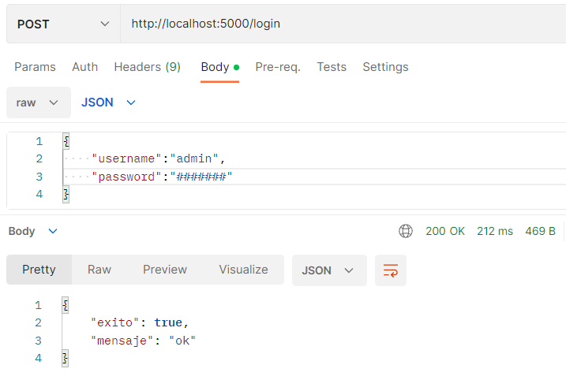
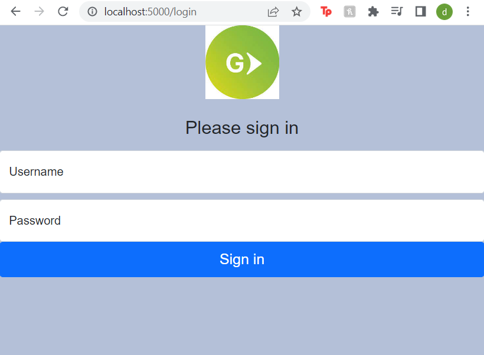
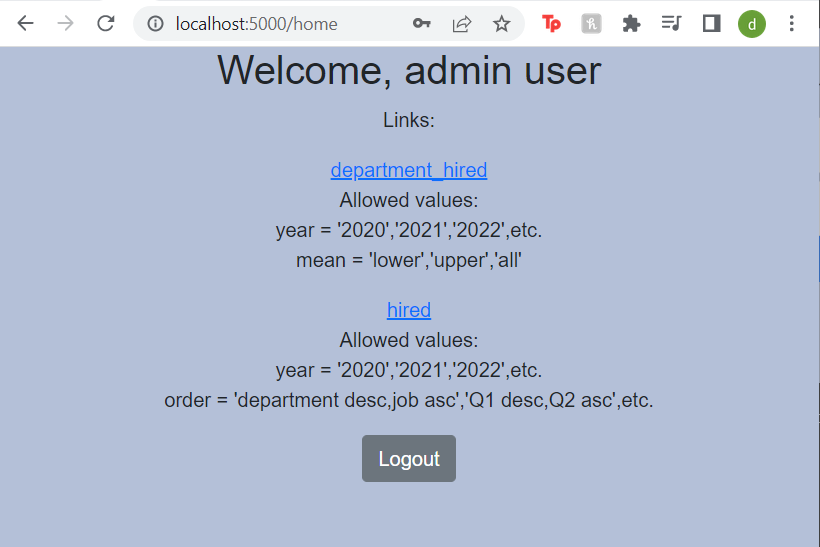
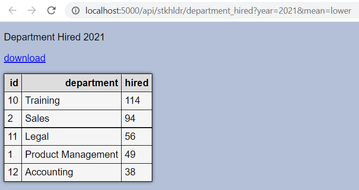
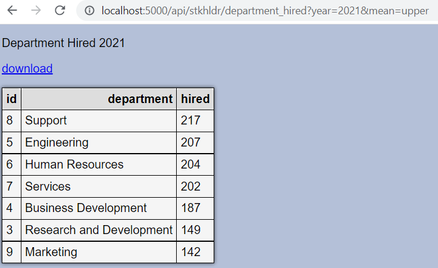

# api_challenge
activate the flask project:
be located in the api_challenge folder
activate the virtual environment

### `.\env\Scripts\activate`

then activate the flask project
### `python .\src\app.py`

## Using the rest api

With api communication service (Postman)

The first service to use must always be the login so that the other services can work without restrictions:

After the correct login message you can access any service that is required
a pdf document of the use of the other api services is attached

Read more [here](./guide.pdf)

with a browser (chrome)

First you must enter the login page

After the correct login the page will redirect you to a home page

there you can access the reports page with the tables and with the parameters that can be varied

this is thye same report with a diferent parameter

# 🌍 In case you want to contact me 👨‍💻:

